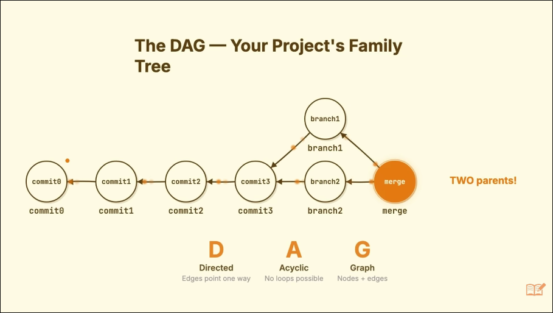
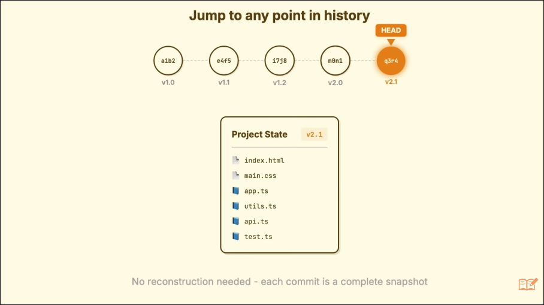
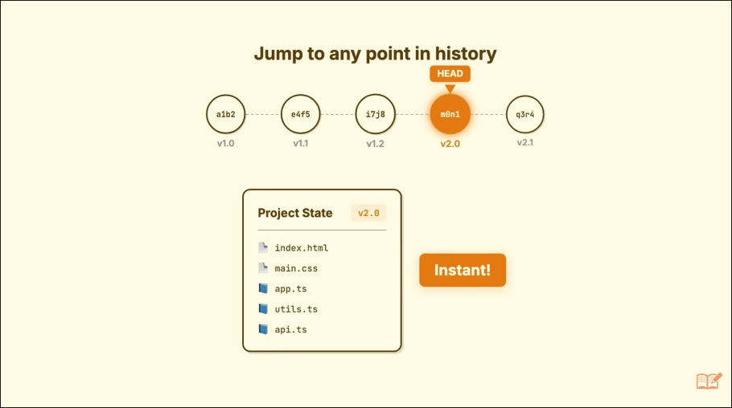

# Beyond the push: What is git, what is it doing under the hood, and how to use it the way it was intended to be used.

I have struggled with git since learning about it three years ago in my introductory CS courses. I only really know how to initialize a repo, add files, commit, and push to the remote repository. However git is more than just a cloud storage for code, it is a version control tool. I want to go deeper than my current knowlegde of git and understand why it was such a great version control and why it still is the industry standard when it comes to code collaboration. I will list all the sources I used to gather information about git up top for easy access.

**Disclaimer** This is written as more of a clarification and deeper dive to those who have already broken a few Git repos. This isn't written as an introduction to Git.

## Sources

- **[Git Will Finally Make Sense After This](https://youtu.be/Ala6PHlYjmw?si=2MRrq_tziHGTpmI1)**: A video by LearnThatStack that explains how Git works.
- **[Visualize Git](https://visualizegit.com/)**: A website that visually shows what happens when you call a git command.
- **[Git Documentation](https://git-scm.com/docs/git)**: Official Git Documentation
- **[What is HEAD in Git](https://www.codingem.com/what-is-head-in-git/)**: Codingem's tutorial on what the HEAD pointer is.

## What is Git

Setting aside all previous assupmtions and starting over, we define Git.

**Git** is a database. And the data stored in that database are _commits_.

**Commits** are records of the repository at a certain point in time. They aren't just recorded changes but the actual state of the files when the commit was taken. A commit contains three things:

1. A pointer to the commit record that has the state of all the files.

2. Metadata about who committed, when the commit happened, and why, the commit message given at the time of commit.

3. A pointer to the Parent commit (BACKWARDS!)

This means that each commit made points back to the commit that comes before it. This is like a singly linked list, where the initial commit doesn't have a parent pointer. When you merge a branch into a commit (this string of linked commits) you make a commit with two parents.

### The Git Tree

As commits are added to Git (the database), children know who their parents are, but parents do not know who their children are. The existing pointers that are assigned between the commits are what Git uses when operations like merge, reset, and rebase are used (more on them later). This means that Git trees are DAGS (Directed Acyclic Graphs) which means, despite feeling complex once we have competing branches, the Git tree remains simple. There is no circular history that would break backtracking, and no way for a commit to overwite another commit in trying to fix conflicts.

The git tree DAG by LearnThatStack

This tree of commits is very helpful when it comes to having a record of your project. Each commit is a complete snapshot, so you can restore the project to any existing commit at any time. There is no walking back up the tree by inversly applying all the changes made. This is done by setting your HEAD pointer to the desired commit.

The HEAD pointer on most recent commit.

The HEAD pointer is moved to older commit, the state immediately available.

### Navigating the Git Tree

**HEAD** is a pointer that tracks where you are in the Git tree. HEAD will always point to the commit that will become the parent of the next commit, and by default will lead you to this most recent commit when you check out a _branch_. You can also navigate to any past commit, which puts the HEAD pointer in detatched mode.

**Branches** unlock a lot of the collborative capability that we get with Git. It is often assumed that branches act as a separate "psuedo-repo" that starts a new commit chain off to the side. In reality even the main branch is a branch, and there is no "seperation" with branches. A branch is an entry in a file that contains the pointer to the most recent commit. When a commit on the main branch is made, the "main" branch pointer is updated to the new commit and moves down the line. When making a branch, you are making a commit that takes a new pointer with it rather than the main pointer. Now there are multiple branch pointers pointing to the most recent commit along the paths down the Git Tree. When you navigate to a new branch, you are moving you (the HEAD pointer) to the commit that the branch pointer is pointing to.

To move to a different commit we use the `git checkout <branch>` command for branches or the `git checkout <commit>` where commit is the commit hash. This moves our HEAD pointer to that commit and we can now see and explore the files from that commit.

### Working Directory, Staging, and Committing!

To understand how commits are created, it's important to know about the three states a file can be in within Git: the working directory, the staging area, and the repository itself.

**Working Directory**: This is the folder on your computer containing all the project files. It's your personal sandbox where you can edit, add, and delete files. Changes made here are not yet recorded by Git.

**Staging Area (or Index)**: The staging area is an intermediate step before committing. When you run `git add <file>`, you are telling Git that you want to include the current state of that file in your next commit. This allows you to group related changes into a single, cohesive snapshot, even if you have other unrelated modifications in your working directory.

**Committing**: After you've staged all the changes for your snapshot, you run `git commit`. This command takes the files from the staging area and creates a new, permanent commit object in the Git repository. This new commit is added to the history, and the current branch pointer moves to point to this new commit.

## Using Git

Git is divided into two types of commands, higher level porcelain commands which are used about 99% of the time [citation needed my Randall Munroe fans], and lower level plumming commands that really let you mess with what is going on. With better understanding of what Git and the commit history is, these commands start making more sense.

### Porcelain Commands

#### `git merge`

> `git merge <branch>` - Joins two or more development histories together.

**Explanation:**
When you are on a branch (e.g., `main`) and run `git merge feature-branch`, Git performs a "merge". It finds the common ancestor of the two branches and creates a new "merge commit". This special commit has two parents: the tip of `main` and the tip of `feature-branch`. This new commit contains the combined changes from both branches. Your current branch pointer (`main`) is then moved to this new merge commit. This is considered a non-destructive operation because it doesn't change the history of the existing branches; it just adds a new commit.

#### `git rebase`

> `git rebase <base>` - Reapplies commits on top of another base tip.

**Explanation:**
Rebasing is another way to integrate changes from one branch to another, but it works very differently from merging. If you are on `feature-branch` and run `git rebase main`, Git will:

1.  Find the common ancestor of `feature-branch` and `main`.
2.  Temporarily save the series of commits you've made on `feature-branch` since that common ancestor.
3.  Reset your `feature-branch` to be identical to `main`.
4.  Apply your saved commits, one by one, on top of `main`, creating new commits with the same changes but different commit IDs.

The result is a linear, cleaner history—it looks as if you started your feature branch from the very latest commit on `main`. However, because it rewrites commit history, it can be dangerous if you're working on a shared branch. The original commits are orphaned and will eventually be deleted.

#### `git reset`

> `git reset [--soft | --mixed | --hard] [<commit>]` - Reset current HEAD to the specified state.

**Explanation:**
`git reset` is a command for undoing changes, and its behavior depends on the mode you use. It moves the current branch pointer to a different commit.

- **`--soft`**: Moves the branch pointer to `<commit>` but does nothing else. The changes from the commits you "undid" are left in the staging area (`git status` will show them as "Changes to be committed").
- **`--mixed` (the default)**: Moves the branch pointer and also resets the staging area to match the specified commit. The changes are still in your working directory, but they are unstaged.
- **`--hard`**: Moves the branch pointer, resets the staging area, and overwrites your working directory to match the specified commit. This is destructive and will permanently delete uncommitted changes.

#### `git revert`

> `git revert <commit>` - Revert some existing commits.

**Explanation:**
`git revert` is used to undo the changes made by a specific commit. Unlike `git reset`, which can alter the project history, `git revert` creates a _new_ commit that applies the inverse of the changes from the target commit. For example, if the original commit added a line of code, the revert commit will remove that line. This is the safe and recommended way to undo changes on a public or shared branch because it doesn't rewrite the commit history that others may be relying on. It simply adds a new commit to the end of the branch history.

### Plumbing Commands

> While porcelain commands are for day-to-day use, plumbing commands give you direct access to the underlying Git objects and repository structure. Understanding them helps demystify what Git is doing. Here are a few key ones.

#### `git cat-file`

> `git cat-file -p <hash>` - Pretty-print the contents of the object at `<hash>`.
> `git cat-file -t <hash>` - Show the type of the object at `<hash>` (blob, tree, commit, or tag).

**Explanation:**
This is your window into the Git database. Every object in Git (a file version is a "blob", a directory is a "tree", a commit is a "commit") has a hash. You can use `cat-file` to see exactly what Git has stored for that hash. For example, `git cat-file -p HEAD` will show you the contents of the most recent commit object: its parent, the tree it points to, the author, and the commit message. [14, 24, 35, 37]

#### `git hash-object`

> `git hash-object <file>` - Computes the object ID value for an object with specified content.

**Explanation:**
This command takes a file and tells you what its hash would be if you were to add it to Git's object database. [8] If you use the `-w` flag (`git hash-object -w <file>`), it will actually write that object into the database. [1, 6] This demonstrates Git's content-addressable storage system: the content of the file determines its hash and how it's stored. It doesn't add the file to the staging area, it just creates the "blob" object.

#### `git write-tree`

> `git write-tree` - Create a tree object from the current index.

**Explanation:**
After you've staged your changes with `git add` (or the plumbing equivalent, `git update-index`), the staging area is ready. `git write-tree` takes the contents of the staging area and writes a "tree" object to the Git database. [5, 30] This tree object represents the state of the project's directory for the upcoming commit. The command returns the hash of the newly created tree object.

#### `git commit-tree`

> `git commit-tree <tree-hash> -p <parent-commit-hash>` - Create a new commit object.

**Explanation:**
This is the command that actually creates a commit. [21] You provide it with the hash of a tree object (from `git write-tree`), the hash of the parent commit(s) (using the `-p` flag), and a commit message via standard input. [29] It will create a new commit object and print its hash. The porcelain `git commit` command is essentially a wrapper around `git write-tree` and `git commit-tree`, plus the logic to update the current branch pointer to the new commit. [5]

### In Practice

Having dug into these more deeply, and understanding what Git actually is, now the common errors I run into while using Git have a solution.

#### Ammending Git commits (forgetting a file or needing to change commit message)

I'll often forget to add a file to my stage before commiting and then make a whole new commit. In an effort to preserve a good commit history with meaningful commits and messages to indicate the state of the project, you can ammend the most recent git commit rather than having to commit again.

> `git commit --ammend` - Run after adding the file(s) missed.
> `git commit --ammend -m "New commit message"` - Replaces the previous commit message with the provided message.

#### Reseting Working Directory to previous commit

If you have been locally working on a feature and have borked everything, you can reset your working directory back to the commit you started with.

> `git reset --hard HEAD` - Undo your changes and start from the most recent commit again. Does not delete any commits, resets your working directory and stage.

> [!CAUTION]
> Using git reset --hard should always spark hesitation, as if used to go to a different commit other than HEAD, all commits which came after that other commit will be deleted and the stage and working directory wiill be reset.

#### Combining local commits into a larger commit

If your local commits would be better served as a single commit and push to the remote, you can "combine" them. This is also helpful if you have made commits that contain errors and you want to fix before pushing them to the remote.

> `git reset --soft <commit>` - This will move your HEAD pointer to the given commit. The commits that came after will be deleted, but your stage and working directory will still contain the changes and edits you made to those commits. This way you can recommit and essentially combine the deleted commits into one.

> `git reset --mixed <commit>` - The mixed flag is the default for the reset command. Mixed will clear your staging area, but keep your working directory. This means that you will need to add the files and their changes to the stage again, but is helpful if you just committed you node_modules or other secerets that you don't want to appear in any git history for someone to find.

#### Revert a pushed commit

If you have made an error in your commit and already pushed it to a shared repository, then you can safely revert it. Reverting doesn't remove the commit, but will undo the effects of that commit onto the current MAIN commit. This is important for shared repositories. If you are using reset or rebase, errors can occur when you delete a commit that someone else will then push back onto the tree when they commit a new change. These errors are very messy and should be avoided.

> `git revert <commit>` - Makes a new commit from MAIN that has had the changes of the provided commit undone to it.

## Final Thoughts

This was a really educational Curiosity Report for me. I have never understood why I needed to add my files, then commit them, then push them when I thought it should just be one command. Understanding the staging, commiting, and pushing better I now see the power it provides in cleaning up the version history. I also didn't know any commands other than `git init`, `git add .`, `git commit -am "did stuff`, `git push`. I feel like now I understand what git actually is and I am not in the dark when problems arise. I feel much more confident in how I can use git to collaborate on a bigger team with lots of branches and fast changes.
